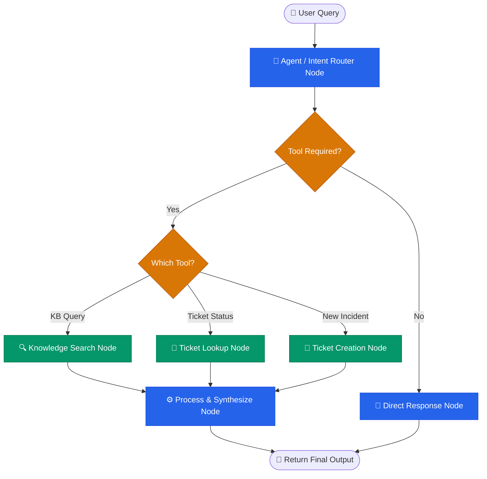

# 🤖 OpsPilot: AI Operations Assistant

## 🎯 Project Title & Problem Statement

**Project Code:** Project 3 — AI Operations Assistant (`opsPilot`)

**Problem Statement:** Corporate IT Service Desks are often overwhelmed with repetitive requests for knowledge base articles, ticket status inquiries, and basic incident reporting. Employees face long wait times for simple resolutions, and IT staff spend valuable time on triage rather than resolution.

**Solution:** **OpsPilot** is an autonomous, first-line virtual IT service desk assistant. Powered by Agentic AI and LangGraph, it understands natural language requests, dynamically routes intents, and interfaces with local corporate databases to retrieve knowledge, look up ticket statuses, and create new incidents—all within a seamless, multi-turn conversational interface.

---

## 🏗️ Solution Overview & Architecture Diagram

OpsPilot uses a **StateGraph** architecture to orchestrate decision-making. The agent determines whether a request requires a direct response, a knowledge lookup, or a mutation to the IT ticket database.



---

## 💻 Technology Stack Matrix

| Category | Technology |
| :--- | :--- |
| **Core Language** | Python 3.14+ (Typing, Pydantic, OOP) |
| **Orchestration** | LangGraph (StateGraph, Nodes, Edges) |
| **Agent Framework** | LangChain / LangGraph Core |
| **LLM Provider** | OpenAI (GPT-4o) / Google Gemini (Switchable) |
| **Data Persistence** | SQLite3 (Embedded database with WAL persistence) |
| **User Interface** | Streamlit |

---

## ⚙️ Installation & Setup Instructions

1. **Clone the repository:**
   ```bash
   git clone <repository_url>
   cd opsPilot
   ```

2. **Set up a Virtual Environment:**
   ```bash
   python -m venv .venv
   .venv\Scripts\activate  # Windows
   # source .venv/bin/activate  # macOS/Linux
   ```

3. **Install Dependencies:**
   ```bash
   pip install -r requirements.txt
   ```

4. **Initialize the Databases:**
   OpsPilot uses SQLite for local mock systems (Employee Registry, Tickets, Systems, KB).
   ```bash
   python scripts/seed_large.py
   ```
   *(Note: You can back up your database state at any time using `python scripts/backup_db.py`)*

---

## 🔐 Required Environment Variables

Create a `.env` file in the project root. Refer to `.env.example`:

```env
# LLM Provider Configuration
LLM_PROVIDER=openai  # or 'gemini'
OPENAI_API_KEY=your_openai_api_key_here
GEMINI_API_KEY=your_gemini_api_key_here

# Database Paths (Optional - defaults mapped automatically)
DATA_DIR=./opspilotdrive/storage/data
DB_PATH=${DATA_DIR}/ops_pilot.db
CHECKPOINT_DB_PATH=${DATA_DIR}/ops_pilot_agent_state.db
```

---

## 🚀 Step-by-Step Run Guide

**To run the interactive Streamlit UI:**
```bash
streamlit run app.py
```
This will launch the `CorpOps AI IT Support Desk` in your web browser. 
You can track active conversational state, inspect tool executions, and reset sessions directly from the sidebar.

**To run the CLI version (Useful for terminal testing):**
```bash
python scripts/cli.py
```

**To run the automated E2E test suite:**
```bash
python -m unittest tests/test_e2e_cli.py
```

---

## 🌟 Sample Inputs & Expected Outputs (Golden Test Cases)

1. **Knowledge Base Retrieval**
   - **Input:** `"How do I reset my VPN password?"`
   - **Output:** The agent searches the KB, finds the relevant article, and provides step-by-step instructions.

2. **Ticket Status Lookup**
   - **Input:** `"Check status of ticket INC-001"`
   - **Output:** The agent queries the database and returns the current ticket status, priority, description, and assigned engineer.

3. **Incident Ticket Creation (Multi-turn)**
   - **Input:** `"My Office 365 is randomly freezing. Please raise a ticket."`
   - **Output:** The agent intercepts the request, maps the software to the corporate registry (SYS-024), and asks for the Employee ID.
   - **Input:** `"EMP001"`
   - **Output:** The agent formulates a structured `TicketDraft` and asks for explicit confirmation before committing to the database.
   - **Input:** `"yes"`
   - **Output:** The ticket is successfully created and a new Ticket ID (e.g., `INC-152`) is returned with an SLA.

---

## 🧠 Key Design Decisions & Known Limitations

- **State Persistence (WAL Mode):** We utilize SQLite with a memory checkpointer to preserve multi-turn conversational state. During testing, WAL/SHM file persistence caused test contamination, which was resolved by implementing robust database tear-down hooks (`flush_chat_db()` and `seed_large.py`) inside `unittest.TestCase.setUpClass`.
- **LLM Keyword Interception:** Naive keyword searches often resulted in overwhelming DB hits (e.g., matching hundreds of systems for generic words like "app"). We implemented a contextual LLM-interception block in `infrastructure_context_check_node` that reduces ambiguous queries down to 1-3 highly specific keywords.
- **Strict DB Mutability Constraints:** The agent is expressly forbidden from directly generating ticket IDs or altering historical ticket trails. All database mutations run through validated CRUD tool wrappers in `ticket_toolchain.py` to ensure system integrity.
- **Known Limitation:** The system relies on semantic keyword matching rather than a fully vectorized similarity search (ChromaDB), which means users must use slightly more explicit terminology when searching for KB articles. Future iterations could replace the SQLite `LIKE` queries with a vector embedding database for enhanced semantic recall.