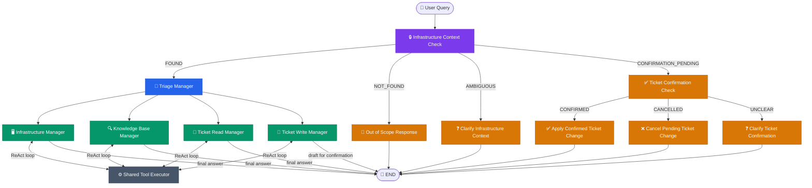

# 🪼 OpsPilot: AI Operations Assistant

## 🎯 Project Title & Problem Statement

**Project Code:** Project 3 — AI Operations Assistant (`opsPilot`)

**Problem Statement:** Corporate IT Service Desks are often overwhelmed with repetitive requests for knowledge base articles, ticket status inquiries, and basic incident reporting. Employees face long wait times for simple resolutions, and IT staff spend valuable time on triage rather than resolution.

**Solution:** **OpsPilot** is an autonomous, first-line virtual IT service desk assistant for Patliputra-Corp. Powered by Agentic AI and LangGraph, it validates every request against a corporate systems catalog, routes intents through specialized managers, and interfaces with local SQLite databases to retrieve knowledge, look up ticket statuses, and create new incidents — all within a seamless, multi-turn conversational interface.

---

## 🏗️ Solution Overview & Architecture Diagram

OpsPilot uses a **StateGraph** architecture with a bounded-context gate. Every user message is first checked against Patliputra-Corp's systems catalog. Only requests that match a supported service proceed to LLM-powered triage, which dispatches to one of four specialized managers.

There is **no "Direct Response" node** — all responses flow through the bounded-context gate and then either a terminal response node (out-of-scope, clarify, confirm) or through a specialized manager that produces the final answer.


```mermaid
flowchart TD
    Start([🚀 User Query]) --> Gate["🔒 Infrastructure Context Check"]

    Gate -->|FOUND| Triage["🧠 Triage Manager"]
    Gate -->|NOT_FOUND| OOS["🚫 Out of Scope Response"]
    Gate -->|AMBIGUOUS| Clarify["❓ Clarify Infrastructure Context"]
    Gate -->|CONFIRMATION_PENDING| ConfCheck["✅ Ticket Confirmation Check"]

    OOS --> EndNode([🏁 END])
    Clarify --> EndNode

    Triage --> InfraMgr["🖥️ Infrastructure Manager"]
    Triage --> KBMgr["🔍 Knowledge Base Manager"]
    Triage --> TktReadMgr["🎫 Ticket Read Manager"]
    Triage --> TktWriteMgr["📝 Ticket Write Manager"]

    InfraMgr <-->|ReAct loop| Tools["⚙️ Shared Tool Executor"]
    KBMgr <-->|ReAct loop| Tools
    TktReadMgr <-->|ReAct loop| Tools
    TktWriteMgr <-->|ReAct loop| Tools

    InfraMgr -->|final answer| EndNode
    KBMgr -->|final answer| EndNode
    TktReadMgr -->|final answer| EndNode
    TktWriteMgr -->|draft for confirmation| EndNode

    ConfCheck -->|CONFIRMED| Apply["✅ Apply Confirmed Ticket Change"]
    ConfCheck -->|CANCELLED| Cancel["❌ Cancel Pending Ticket Change"]
    ConfCheck -->|UNCLEAR| ClarifyConf["❓ Clarify Ticket Confirmation"]
    Apply --> EndNode
    Cancel --> EndNode
    ClarifyConf --> EndNode

    classDef gate fill:#7c3aed,stroke:#6d28d9,color:#ffffff;
    classDef triage fill:#2563eb,stroke:#1d4ed8,color:#ffffff;
    classDef manager fill:#059669,stroke:#047857,color:#ffffff;
    classDef terminal fill:#d97706,stroke:#b45309,color:#ffffff;
    classDef tools fill:#475569,stroke:#334155,color:#ffffff;
    class Gate gate;
    class Triage triage;
    class InfraMgr,KBMgr,TktReadMgr,TktWriteMgr manager;
    class OOS,Clarify,ConfCheck,Apply,Cancel,ClarifyConf terminal;
    class Tools tools;
```

---

## 💻 Technology Stack Matrix

| Category | Technology |
| :--- | :--- |
| **Core Language** | Python 3.14+ (Typing, Pydantic, OOP) |
| **Orchestration** | LangGraph (StateGraph, Nodes, Conditional Edges) |
| **Agent Framework** | LangChain / LangGraph Core |
| **LLM Provider** | OpenAI (GPT-4o-mini, default) / Google Gemini (gemini-3.5-flash-lite, switchable via `config.yaml`) |
| **Data Persistence** | SQLite3 (Embedded, WAL mode for checkpoints) |
| **Checkpoint/State** | `langgraph-checkpoint-sqlite` (`SqliteSaver` + `JsonPlusSerializer`) |
| **Data Models** | Pydantic `BaseModel` for validation/serialization |
| **User Interface** | Streamlit |
| **Configuration** | `config.yaml` + `.env` (via `python-dotenv`) |
| **Logging** | Loguru (structured application + audit logs) |
| **ID Generation** | `ulid-py` (time-sortable unique IDs) |
| **Date Parsing** | `dateparser` (natural language date input) |
| **Testing** | `pytest` + `pytest-mock` |

---

## 📂 Project Structure

```
opsPilot/
├── app.py                          # Streamlit UI entry point
├── requirements.txt                # pip dependencies
├── .env.example                    # Environment variable template
├── GEMINI.md                       # AI assistant rules
│
├── src/ops_pilot/                  # Main application package
│   ├── agent/
│   │   ├── graph.py                # StateGraph construction and compilation
│   │   ├── nodes.py                # All 13 graph node implementations
│   │   ├── router.py               # Conditional edge routing functions
│   │   └── state.py                # AgentState, TriageDecision, TicketDraft
│   ├── config/
│   │   ├── config.yaml             # LLM provider & model configuration
│   │   └── settings.py             # YAML + env loader (Settings class)
│   ├── models/
│   │   ├── employee.py             # Employee Pydantic model
│   │   ├── knowledge_base.py       # KnowledgeBase Pydantic model
│   │   ├── system.py               # System Pydantic model
│   │   └── ticket.py               # Ticket Pydantic model
│   ├── prompts/
│   │   └── system_prompt.py        # All LLM system prompts (5 prompts)
│   ├── repository/
│   │   ├── employee_repository.py  # Employee CRUD + search
│   │   ├── knowledge_base_repository.py  # KB article search
│   │   ├── system_repository.py    # Systems catalog + keyword search
│   │   └── ticket_repository.py    # Ticket CRUD + search
│   ├── tools/
│   │   ├── employee_toolchain.py   # search_employee_tool, count/get by dept
│   │   ├── kb_toolchain.py         # search/count KB articles
│   │   ├── system_toolchain.py     # search/count systems
│   │   └── ticket_toolchain.py     # search/create/update tickets
│   ├── ui/
│   │   └── theme.py                # Streamlit enterprise CSS theme
│   └── utils/
│       ├── error_handler.py        # Tool error decorator
│       ├── id_generator.py         # Sequential ticket ID generation
│       ├── large_language_models.py # LLM factory (OpenAI/Gemini)
│       ├── logger.py               # Loguru logger setup
│       └── validators.py           # Input validation helpers
│
├── scripts/
│   ├── init_db.py                  # Create SQLite schema (5 tables)
│   ├── seed_large.py               # Populate with large seed dataset
│   ├── seed_small.py               # Populate with small seed dataset
│   ├── backup_db.py                # Database backup utility
│   ├── flush_chat_db.py            # Clear checkpoint/chat state
│   ├── flush_ops_db.py             # Clear operational data
│   ├── cli.py                      # Terminal-based chat interface
│   └── visualize_graph.py          # Export graph to Mermaid diagram
│
├── tests/
│   ├── conftest.py                 # Pytest fixtures (session-scoped test DB)
│   ├── test_e2e_cli.py             # End-to-end CLI tests
│   ├── agent/                      # Agent-level unit tests
│   ├── repository/                 # Repository-level unit tests
│   ├── tools/                      # Toolchain unit tests
│   └── utils/                      # Utility unit tests
│
├── docs/
│   └── architecture.md             # Detailed architecture documentation
│
└── opspilotdrive/storage/data/     # SQLite database files (runtime)
```

---

## ⚙️ Installation & Setup Instructions

1. **Clone the repository:**
   ```bash
   git clone <repository_url>
   cd opsPilot
   ```

2. **Set up a Virtual Environment:**
   ```bash
   python -m venv .venv
   .venv\Scripts\activate  # Windows
   # source .venv/bin/activate  # macOS/Linux
   ```

3. **Install Dependencies:**
   ```bash
   pip install -r requirements.txt
   ```

4. **Configure Environment Variables:**
   Copy `.env.example` to `.env` and fill in your API keys:
   ```bash
   copy .env.example .env
   ```

5. **Initialize the Databases:**
   OpsPilot uses SQLite for local mock systems (Employee Registry, Tickets, Systems, KB) and a separate SQLite DB for LangGraph checkpoints.
   ```bash
   python scripts/init_db.py
   python scripts/seed_large.py
   ```
   *(Note: You can back up your database state at any time using `python scripts/backup_db.py`)*

---

## 🔐 Required Environment Variables

Create a `.env` file in the project root. Refer to `.env.example`:

```env
# LLM Provider API Keys
OPENAI_API_KEY=your_openai_api_key_here
GEMINI_API_KEY=your_gemini_api_key_here
HUGGINGFACE_API_KEY=your_huggingface_api_key_here

# Database Paths
DATA_DIR=./opspilotdrive/storage/data
DB_PATH=${DATA_DIR}/ops_pilot.db
CHECKPOINT_DB_PATH=${DATA_DIR}/ops_pilot_agent_state.db
```

The LLM provider is selected in `src/ops_pilot/config/config.yaml` (not via env):

```yaml
llm:
  provider: openai       # or 'gemini'
  gemini:
    model_name: gemini-3.5-flash-lite
  openai:
    model_name: gpt-4o-mini
```

---

## 🚀 Step-by-Step Run Guide

**To run the interactive Streamlit UI:**
```bash
streamlit run app.py
```
This launches the OpsPilot IT Support Desk in your web browser.
You can track active conversational state, inspect tool executions, and reset sessions directly from the sidebar.

**To run the CLI version (useful for terminal testing):**
```bash
python scripts/cli.py
```

**To run the test suite:**
```bash
pytest
```

---

## 🌟 Sample Inputs & Expected Outputs (Golden Test Cases)

1. **Knowledge Base Retrieval**
   - **Input:** `"How do I reset my VPN password?"`
   - **Flow:** `INFRASTRUCTURE_CONTEXT_CHECK` (matches VPN system) → `TRIAGE_MANAGER` (routes to KB) → `KNOWLEDGE_BASE_MANAGER` (searches articles) → returns step-by-step instructions.

2. **Ticket Status Lookup**
   - **Input:** `"Check status of ticket INC-001"`
   - **Flow:** `INFRASTRUCTURE_CONTEXT_CHECK` → `TRIAGE_MANAGER` (routes to ticket read) → `TICKET_READ_MANAGER` (looks up by ID) → returns ticket status, priority, description, and assigned engineer.

3. **Incident Ticket Creation (Multi-turn)**
   - **Input:** `"My Office 365 is randomly freezing. Please raise a ticket."`
   - **Flow:** `INFRASTRUCTURE_CONTEXT_CHECK` (matches Office 365 system) → `TRIAGE_MANAGER` → `TICKET_WRITE_MANAGER` (gathers details, asks for Employee ID).
   - **Input:** `"EMP001"`
   - **Flow:** `TICKET_WRITE_MANAGER` (looks up employee, emits `TicketDraft` tool call, presents confirmation summary).
   - **Input:** `"yes"`
   - **Flow:** `INFRASTRUCTURE_CONTEXT_CHECK` (detects `awaiting_ticket_confirmation`) → `TICKET_CONFIRMATION_CHECK` (regex: "yes" = CONFIRMED) → `APPLY_CONFIRMED_TICKET_CHANGE` (creates ticket, returns new ID with SLA).

4. **Out-of-Scope Request**
   - **Input:** `"What's the weather today?"`
   - **Flow:** `INFRASTRUCTURE_CONTEXT_CHECK` (no catalog match) → `OUT_OF_SCOPE_RESPONSE` → returns message explaining OpsPilot only handles Patliputra-Corp services.

---

## 🧠 Key Design Decisions & Known Limitations

- **Bounded-Context Gate:** Every user message must first match a supported system in the Patliputra-Corp catalog before any LLM-based processing occurs. This prevents the agent from providing generic IT advice for unsupported services. When the initial keyword search is ambiguous (> 1 match), an LLM extracts refined keywords before re-searching.

- **Context Lock:** Once a system context is established (`FOUND`) and a manager branch is active, subsequent messages in the same conversation reuse the locked context. This prevents mid-conversation context drift when the user provides follow-up details that might match a different system.

- **Guidance-Request Override:** The triage node includes a regex-based guard that detects "how do I…" / "how can I…" patterns. If the LLM misclassifies a guidance question as `TICKET_ACTION_REQUEST`, the classification is overridden to `INFRASTRUCTURE_LOOKUP_REQUEST`.

- **Two-Phase Ticket Mutation:** `TICKET_WRITE_MANAGER` never calls `create_ticket_tool` or `update_ticket_tool` directly. It emits a `TicketDraft` structured tool call that the node intercepts and persists. Actual mutation only happens in `APPLY_CONFIRMED_TICKET_CHANGE` after explicit user confirmation via regex matching.

- **State Persistence (WAL Mode):** OpsPilot uses `SqliteSaver` with `JsonPlusSerializer` for LangGraph checkpoint persistence. `System` and `TicketDraft` Pydantic models are explicitly allowlisted for msgpack serialization. During testing, WAL/SHM file persistence caused test contamination, which was resolved by implementing robust database tear-down hooks (`flush_chat_db.py` and `seed_large.py`) inside `conftest.py`.

- **LLM Keyword Interception:** Naive keyword searches often resulted in overwhelming DB hits (e.g., matching hundreds of systems for generic words like "app"). The LLM-powered keyword extraction in `infrastructure_context_check_node` reduces ambiguous queries down to 1-3 highly specific keywords.

- **Strict DB Mutability Constraints:** The agent is expressly forbidden from directly generating ticket IDs or altering historical ticket trails. All database mutations run through validated CRUD tool wrappers in `ticket_toolchain.py` to ensure system integrity. Sequential ticket IDs (e.g., `INC-152`, `ITR-003`) are generated via a `id_sequences` table to ensure uniqueness.

- **Known Limitation:** The system relies on semantic keyword matching rather than a fully vectorized similarity search (ChromaDB), which means users must use slightly more explicit terminology when searching for KB articles. Future iterations could replace the SQLite `LIKE` queries with a vector embedding database for enhanced semantic recall.
