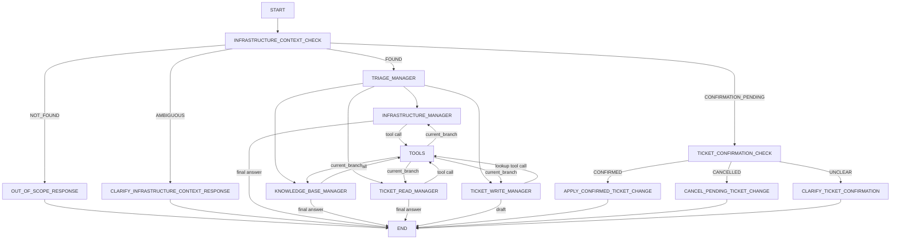

# OpsPilot Agent Graph Architecture

OpsPilot is an IT support assistant for the bounded context of Patliputra-Corp. The `systems` registry is the catalog of supported services, vendors, infrastructure, and asset groups. Every new user request is checked against that catalog before an LLM chooses a specialist.

## Graph flow

The only ReAct cycle is one manager to `TOOLS` and back to that same manager. A completed manager never falls through to another manager, and malformed `current_branch` state raises an error instead of defaulting to infrastructure.

## Naming and state contracts

- `*_REQUEST` values in `TriageDecision.next_node` are LLM classification results.
- `*_MANAGER` values are concrete graph nodes.
- `current_branch` identifies the manager that requested the current tool call.
- `infrastructure_context_status` is the deterministic catalog result: `FOUND`, `NOT_FOUND`, `AMBIGUOUS`, or `CONFIRMATION_PENDING` for a pending ticket continuation.
- `infrastructure_context` contains the matching `System` records passed into triage and specialist prompts.
- `completed_steps` and `execution_count` provide a bounded diagnostic trace for the current user turn. `INFRASTRUCTURE_CONTEXT_CHECK` resets them at the start of each turn; the checkpoint preserves conversation and ticket state, not a conversation-wide step budget.

## Bounded-context gate

`INFRASTRUCTURE_CONTEXT_CHECK` searches keywords from the complete latest human request using the repository-level `search_supported_systems_from_request` function. It does not call an LLM or the LLM-facing system tool.

- One highest-scoring catalog record: continue to `TRIAGE_MANAGER` with that record as context.
- Multiple tied records: ask the user to identify the supported service/vendor/system and end the turn.
- No match: explain that OpsPilot supports only Patliputra-Corp catalog entries and end the turn without generic KB or ticket behavior.

This is a bounded-context existence check, not an administrative onboarding lifecycle and not a new database field.

## Specialist responsibilities

- `INFRASTRUCTURE_MANAGER`: report confirmed catalog/status data and perform additional system lookups only when needed.
- `KNOWLEDGE_BASE_MANAGER`: search Patliputra-Corp KB material using the confirmed infrastructure context; do not provide unsupported open-world instructions.
- `TICKET_READ_MANAGER`: read tickets relevant to the confirmed context; never mutate.
- `TICKET_WRITE_MANAGER`: gather lookup information and prepare a draft. Mutation tools are applied only by `APPLY_CONFIRMED_TICKET_CHANGE` after a persisted explicit confirmation.

## Persistence and UI boundary

The graph uses `SqliteSaver` keyed by Streamlit's `thread_id`. The UI submits only the new human message on each turn so checkpointed context, trace, and ticket drafts are not overwritten by fresh state defaults. `System` and `TicketDraft` are explicitly allowlisted for checkpoint serialization. The UI may show safe catalog context and tool details, but not prompts, secrets, or internal tool errors.
