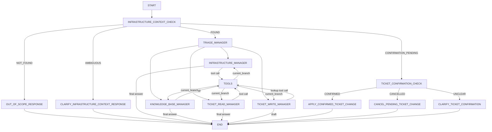

# OpsPilot Agent Graph Architecture

OpsPilot is an IT support assistant for the bounded context of Patliputra-Corp. The `systems` registry is the catalog of supported services, vendors, infrastructure, and asset groups. Every new user request is checked against that catalog before an LLM chooses a specialist.

## Graph flow

```mermaid
graph TD
    START --> INFRASTRUCTURE_CONTEXT_CHECK
    INFRASTRUCTURE_CONTEXT_CHECK -->|FOUND| TRIAGE_MANAGER
    INFRASTRUCTURE_CONTEXT_CHECK -->|NOT_FOUND| OUT_OF_SCOPE_RESPONSE
    INFRASTRUCTURE_CONTEXT_CHECK -->|AMBIGUOUS| CLARIFY_INFRASTRUCTURE_CONTEXT_RESPONSE
    INFRASTRUCTURE_CONTEXT_CHECK -->|CONFIRMATION_PENDING| TICKET_CONFIRMATION_CHECK

    OUT_OF_SCOPE_RESPONSE --> END
    CLARIFY_INFRASTRUCTURE_CONTEXT_RESPONSE --> END

    TRIAGE_MANAGER --> INFRASTRUCTURE_MANAGER
    TRIAGE_MANAGER --> KNOWLEDGE_BASE_MANAGER
    TRIAGE_MANAGER --> TICKET_READ_MANAGER
    TRIAGE_MANAGER --> TICKET_WRITE_MANAGER

    INFRASTRUCTURE_MANAGER -->|tool call| TOOLS
    KNOWLEDGE_BASE_MANAGER -->|tool call| TOOLS
    TICKET_READ_MANAGER -->|tool call| TOOLS
    TICKET_WRITE_MANAGER -->|lookup tool call| TOOLS
    TOOLS -->|current_branch| INFRASTRUCTURE_MANAGER
    TOOLS -->|current_branch| KNOWLEDGE_BASE_MANAGER
    TOOLS -->|current_branch| TICKET_READ_MANAGER
    TOOLS -->|current_branch| TICKET_WRITE_MANAGER

    INFRASTRUCTURE_MANAGER -->|final answer| END
    KNOWLEDGE_BASE_MANAGER -->|final answer| END
    TICKET_READ_MANAGER -->|final answer| END
    TICKET_WRITE_MANAGER -->|draft| END

    TICKET_CONFIRMATION_CHECK -->|CONFIRMED| APPLY_CONFIRMED_TICKET_CHANGE
    TICKET_CONFIRMATION_CHECK -->|CANCELLED| CANCEL_PENDING_TICKET_CHANGE
    TICKET_CONFIRMATION_CHECK -->|UNCLEAR| CLARIFY_TICKET_CONFIRMATION
    APPLY_CONFIRMED_TICKET_CHANGE --> END
    CANCEL_PENDING_TICKET_CHANGE --> END
    CLARIFY_TICKET_CONFIRMATION --> END
```

The only ReAct cycle is one manager to `TOOLS` and back to that same manager. A completed manager never falls through to another manager, and malformed `current_branch` state raises an error instead of defaulting to infrastructure.

## Complete node inventory

The graph registers **13 nodes** (listed as registered in `graph.py`):

| Node Name | Implemented By | LLM? | Purpose |
| :--- | :--- | :---: | :--- |
| `INFRASTRUCTURE_CONTEXT_CHECK` | `infrastructure_context_check_node` | Conditional | Bounded-context gate. Deterministic keyword search + LLM fallback for refinement. |
| `OUT_OF_SCOPE_RESPONSE` | `out_of_scope_response_node` | No | Returns a canned message when no catalog match is found. |
| `CLARIFY_INFRASTRUCTURE_CONTEXT_RESPONSE` | `clarify_infrastructure_context_response_node` | No | Lists 2-3 ambiguous catalog matches and asks the user to pick one. |
| `TICKET_CONFIRMATION_CHECK` | `ticket_confirmation_check_node` | No | Regex-based yes/no interpretation of the user's confirmation reply. |
| `APPLY_CONFIRMED_TICKET_CHANGE` | `apply_confirmed_ticket_change_node` | No | Applies the persisted `TicketDraft` via `create_ticket_tool` or `update_ticket_tool`. |
| `CANCEL_PENDING_TICKET_CHANGE` | `cancel_pending_ticket_change_node` | No | Clears the pending draft and resets confirmation state. |
| `CLARIFY_TICKET_CONFIRMATION` | `clarify_ticket_confirmation_node` | No | Asks the user to answer yes or no. |
| `TRIAGE_MANAGER` | `triage_node` | Yes | Structured-output LLM classification into one of four `TriageDecision` values. |
| `INFRASTRUCTURE_MANAGER` | `infra_node` | Yes | System/status lookups via `search_systems_tool`, `count_systems_tool`. |
| `KNOWLEDGE_BASE_MANAGER` | `kb_node` | Yes | KB article search via `search_knowledge_base_tool`, `count_knowledge_base_articles_tool`. |
| `TICKET_READ_MANAGER` | `ticket_read_node` | Yes | Read-only ticket queries via `search_ticket_by_id_tool`, `search_tickets_tool`, `search_employee_tool`, `search_systems_tool`. |
| `TICKET_WRITE_MANAGER` | `ticket_logger_node` | Yes | Gathers draft details via lookup tools + `TicketDraft` structured tool call. |
| `TOOLS` | `tools_node` (shared `ToolNode`) | No | Executes the tool requested by the calling manager. |

## Tool-binding per manager

Each manager's LLM is bound to a strict subset of tools. The shared `ToolNode` executor knows all tools, but a manager can only *request* those it was bound to.

| Manager | Bound Tools |
| :--- | :--- |
| `INFRASTRUCTURE_MANAGER` | `search_systems_tool`, `count_systems_tool` |
| `KNOWLEDGE_BASE_MANAGER` | `search_knowledge_base_tool`, `count_knowledge_base_articles_tool` |
| `TICKET_READ_MANAGER` | `search_ticket_by_id_tool`, `search_tickets_tool`, `search_employee_tool`, `search_systems_tool` |
| `TICKET_WRITE_MANAGER` | `search_employee_tool`, `search_systems_tool`, `search_ticket_by_id_tool`, `search_tickets_tool`, `TicketDraft` (Pydantic structured tool) |

`TRIAGE_MANAGER` has no tools. It uses `with_structured_output(TriageDecision)` to emit a classification.

## Naming and state contracts

- `*_REQUEST` values in `TriageDecision.next_node` are LLM classification results.
- `*_MANAGER` values are concrete graph nodes.
- `current_branch` identifies the manager that requested the current tool call.
- `infrastructure_context_status` is the gate result: `FOUND`, `NOT_FOUND`, `AMBIGUOUS`, or `CONFIRMATION_PENDING`.
- `infrastructure_context` contains the matching `System` records passed into triage and specialist prompts.
- `completed_steps` and `execution_count` provide a bounded diagnostic trace for the current user turn. `INFRASTRUCTURE_CONTEXT_CHECK` resets them at the start of each turn (via `reset=True`); the checkpoint preserves conversation and ticket state, not a conversation-wide step budget.
- `pending_ticket_draft` holds a `TicketDraft` Pydantic model when `TICKET_WRITE_MANAGER` emits a structured draft call.
- `awaiting_ticket_confirmation` is set to `True` when a draft is pending user confirmation.
- `ticket_confirmation_decision` holds the outcome: `CONFIRMED`, `CANCELLED`, or `UNCLEAR`.
- `request_origin` is a context-only field (`"human"` | `"agent"` | `"system"`), defaulting to `"human"`.

## Bounded-context gate

`INFRASTRUCTURE_CONTEXT_CHECK` resolves the user's request against Patliputra-Corp's system catalog before any LLM-based triage runs.

**Decision logic:**

1. **Confirmation pending?** If `awaiting_ticket_confirmation` is `True`, skip the catalog search and route to `TICKET_CONFIRMATION_CHECK`.
2. **Context lock.** If the gate already found a system (`status == FOUND`) and a `current_branch` is set, the existing context is preserved and triage runs again with the locked-in system context. This prevents mid-conversation context drift.
3. **Keyword search.** Extract the latest human message and call `system_repository.search_supported_systems_from_request()`.
4. **LLM keyword refinement.** If the keyword search returns more than one match, an LLM is invoked with `INFRASTRUCTURE_KEYWORD_EXTRACTION_PROMPT` to extract 1-3 refined keywords. The search is re-run with those keywords.
5. **Outcome:**
   - Exactly 1 match: `FOUND` - continue to `TRIAGE_MANAGER` with that record as context.
   - 2-3 matches (after refinement): `AMBIGUOUS` - ask the user to pick one and end the turn.
   - 0 matches or > 3 matches: `NOT_FOUND` - explain that OpsPilot supports only Patliputra-Corp catalog entries and end the turn.

> **Note:** Despite being called a "context check", this gate **does** invoke an LLM for keyword refinement when the initial search is ambiguous (> 1 match). The LLM call is a fallback to narrow results, not a classification decision.

## Triage classification

`TRIAGE_MANAGER` uses `with_structured_output(TriageDecision)` to classify the user's intent into exactly one of four values:

| `TriageDecision.next_node` | Routes To |
| :--- | :--- |
| `INFRASTRUCTURE_LOOKUP_REQUEST` | `INFRASTRUCTURE_MANAGER` |
| `KNOWLEDGE_BASE_LOOKUP_REQUEST` | `KNOWLEDGE_BASE_MANAGER` |
| `TICKET_LOOKUP_REQUEST` | `TICKET_READ_MANAGER` |
| `TICKET_ACTION_REQUEST` | `TICKET_WRITE_MANAGER` |

**Guidance-request override:** After triage, `triage_node` checks whether the latest human message matches a guidance pattern (`"how do I..."`, `"how can I..."`, `"what are the steps..."`, `"can you explain..."`). If the LLM classified it as `TICKET_ACTION_REQUEST` but the message is actually a guidance request, the decision is overridden to `INFRASTRUCTURE_LOOKUP_REQUEST` with an updated routing reason. This prevents "How can I raise a reimbursement request?" from triggering ticket creation.

## Specialist responsibilities

- `INFRASTRUCTURE_MANAGER`: report confirmed catalog/status data and perform additional system lookups only when needed.
- `KNOWLEDGE_BASE_MANAGER`: search Patliputra-Corp KB material using the confirmed infrastructure context; do not provide unsupported open-world instructions.
- `TICKET_READ_MANAGER`: read tickets relevant to the confirmed context; never mutate.
- `TICKET_WRITE_MANAGER`: gather lookup information and prepare a `TicketDraft` via structured tool call. When the LLM emits a `TicketDraft` tool call, the node intercepts it, persists the draft in state (`pending_ticket_draft`), sets `awaiting_ticket_confirmation = True`, and presents a formatted confirmation summary to the user. Mutation tools (`create_ticket_tool`, `update_ticket_tool`) are applied only by `APPLY_CONFIRMED_TICKET_CHANGE` after a persisted explicit confirmation. The `TICKET_WRITE_MANAGER` LLM never directly calls mutation tools.

## Ticket confirmation flow

When the user responds to a pending ticket draft:

1. `INFRASTRUCTURE_CONTEXT_CHECK` detects `awaiting_ticket_confirmation == True` and routes to `TICKET_CONFIRMATION_CHECK`.
2. `TICKET_CONFIRMATION_CHECK` performs regex matching against the user's reply:
   - `yes | y | confirm | confirmed | proceed | go ahead | do it` -> `CONFIRMED`
   - `no | n | cancel | stop | do not | don't` -> `CANCELLED`
   - Anything else -> `UNCLEAR`
3. The router dispatches to:
   - `APPLY_CONFIRMED_TICKET_CHANGE` - validates draft fields, invokes `create_ticket_tool` or `update_ticket_tool`, clears confirmation state.
   - `CANCEL_PENDING_TICKET_CHANGE` - clears draft and confirmation state, preserves infrastructure context.
   - `CLARIFY_TICKET_CONFIRMATION` - asks the user to answer yes or no, leaves state unchanged.

## Prompt context injection

All four specialist managers receive their system prompt augmented by `_prompt_with_routing_context()`, which appends:

1. The triage `routing_reason` (internal context, not quoted to the user).
2. The confirmed `infrastructure_context` - each matching `System` record's ID, name, status, description, and last-checked timestamp.

## Execution safety

- **Step budget:** `MAX_EXECUTION_STEPS = 200` per user turn. Every node call increments `execution_count`. Exceeding the budget raises a `RuntimeError` with a full trace.
- **Router validation:** All routers (`route_after_infrastructure_context`, `route_after_ticket_confirmation_check`, `triage_router`, `route_after_tools`) raise `RuntimeError` on invalid state values instead of silently defaulting.
- **Tool error handling:** `ToolNode` is configured with `handle_tool_errors=True`, converting exceptions into `ToolMessage` objects the calling manager can reason about.

## Guardrails

OpsPilot implements guardrails at every layer of the stack. The table below catalogues each mechanism, where it lives, and what it prevents.

### Graph-level guardrails

| Guardrail | Location | What it prevents |
| :--- | :--- | :--- |
| **Bounded-context gate** | `infrastructure_context_check_node` in `nodes.py` | Blocks requests that don't match any Patliputra-Corp system from reaching LLM triage. Out-of-scope or ambiguous requests are handled by deterministic response nodes — no LLM-generated speculation. |
| **Context lock** | `infrastructure_context_check_node` (lines 254–259) | Prevents mid-conversation context drift. Once a system context is established and a manager branch is active, subsequent messages reuse the locked context instead of re-searching. |
| **Guidance-request override** | `triage_node` (lines 200–206) | Regex guard that detects "how do I…" patterns. Overrides LLM misclassification of guidance questions as `TICKET_ACTION_REQUEST` to `INFRASTRUCTURE_LOOKUP_REQUEST`, preventing accidental ticket creation. |
| **Execution step budget** | `_step_update()` in `nodes.py` | Hard cap of `MAX_EXECUTION_STEPS = 200` per user turn. Every node increments `execution_count`; exceeding raises `RuntimeError` with full trace. Prevents infinite ReAct loops. |
| **Router validation** | All 4 routers in `router.py` | Every router raises `RuntimeError` on invalid/missing state values instead of silently defaulting to a fallback node. Prevents silent misrouting. |
| **Two-phase ticket mutation** | `ticket_logger_node` + `apply_confirmed_ticket_change_node` | `TICKET_WRITE_MANAGER` never calls mutation tools directly. It emits a `TicketDraft` that the node intercepts and persists. Actual mutation only happens in a separate node after explicit user confirmation. Prevents unintended DB writes. |
| **Regex-based confirmation parsing** | `ticket_confirmation_check_node` (lines 331–343) | Deterministic regex matching for yes/no — no LLM interpretation of confirmation intent. Ambiguous replies route to `CLARIFY_TICKET_CONFIRMATION`. |
| **Draft completeness check** | `apply_confirmed_ticket_change_node` (lines 377–391) | Before executing a CREATE, validates that all required fields (`employee_id`, `title`, `description`, `status`, `category`, `ticket_type`) are populated. Raises `RuntimeError` on missing fields. |

### Tool-level guardrails

| Guardrail | Location | What it prevents |
| :--- | :--- | :--- |
| **Strict tool binding** | `nodes.py` (per-manager tool lists) | Each manager's LLM is bound to only its authorized subset of tools. `TICKET_READ_MANAGER` cannot call `create_ticket_tool`; `KNOWLEDGE_BASE_MANAGER` cannot call `search_tickets_tool`. Prevents cross-domain tool misuse. |
| **`@handle_tool_errors` decorator** | `error_handler.py` | Wraps every `@tool` function. `ValueError` → returns `"Validation Error: …"` string to the LLM. `Exception` → logs with traceback, returns generic `"System Error: …"` string. Prevents stack traces from leaking to the user or crashing the graph. |
| **`ToolNode(handle_tool_errors=True)`** | `graph.py` (line 32) | The shared tool executor converts tool exceptions into `ToolMessage` objects so the calling manager can reason about the error and recover gracefully instead of crashing. |
| **`TicketDraft` interception** | `ticket_logger_node` (lines 121–134) | The `TicketDraft` Pydantic model is listed as a "tool" for structured output but is intercepted by the node before reaching the `ToolNode`. This prevents the LLM from directly executing a mutation through the tool pipeline. |

### Data-level guardrails

| Guardrail | Location | What it prevents |
| :--- | :--- | :--- |
| **Pydantic `BaseModel` validation** | All models (`employee.py`, `ticket.py`, `system.py`, `knowledge_base.py`) | Field constraints (`min_length`, `max_length`, type validation) enforced at model construction via Pydantic. Rejects malformed data before it reaches the DB. |
| **Whitelist validators** | `validators.py` | `validate_status()` — only `Open`, `In Progress`, `Resolved`, `Closed`, `On Hold`. `validate_priority()` — only `Low`, `Medium`, `High`, `Critical`. `validate_ticket_type()` — only `INC`, `ITR`. Rejects any LLM-invented values. |
| **ID format enforcement** | `validate_id_format()` in `validators.py` | Regex `^[a-zA-Z0-9\-]+$` enforced on all IDs (`employee_id`, `ticket_id`, `system_id`, `assigned_to`). Prevents SQL injection via malformed IDs. |
| **Parameterized SQL queries** | All repository files | Every SQL query uses `?` parameter placeholders, never string interpolation. Prevents SQL injection at the DB layer. |
| **Duplicate ticket detection** | `create_ticket_tool` (lines 150–153 in `ticket_toolchain.py`) | Before creating, searches for existing open/in-progress tickets with the same title for the same employee and system. Raises `ValueError` with the existing ticket ID. |
| **Foreign key validation** | `create_ticket_tool` (lines 141–147) | Validates that both `employee_id` and `system_id` exist in their respective tables before creating a ticket. Prevents orphaned references. |
| **Stop-word filtering** | `_SYSTEM_STOP_WORDS` + `_meaningful_system_terms()` in `system_repository.py` | Strips common English words and IT noise terms (30+ words like "help", "issue", "broken", "connect") from search queries. Prevents overly broad catalog matches that would bypass the bounded-context gate. |
| **Sequential ID generation** | `id_generator.py` | Ticket IDs are generated via an atomic `UPSERT` on a `id_sequences` table — never by the LLM. Prevents the agent from fabricating or guessing IDs. |
| **Ambiguous employee guard** | `search_employee_tool` (lines 56–57 in `employee_toolchain.py`) | If search returns > 3 employees, raises `ValueError` asking the user to confirm the exact ID. Prevents the agent from guessing the wrong person. |

### Prompt-level guardrails

| Guardrail | Location | What it prevents |
| :--- | :--- | :--- |
| **Role-prompting** | All 5 system prompts in `system_prompt.py` | Each manager is explicitly scoped ("Your ONLY job is to…"). Prevents scope creep across domains. |
| **Negative-prompting** | KB, Infra, Ticket Read prompts | Explicit "Do not attempt to create tickets", "Do not search the knowledge base", "strictly read-only". Prevents cross-domain actions even if the LLM wants to be helpful. |
| **Constrained structured output** | `TriageDecision` Pydantic model in `state.py` | Triage LLM can only emit one of 4 `Literal` values. `with_structured_output()` enforces the schema — no free-text routing. |
| **Priority matrix in prompt** | `TICKET_WRITE_MANAGER_PROMPT` (line 129) | Explicit severity rules (Critical/High/Medium/Low) prevent the agent from asking the user for priority or hallucinating severity. |
| **"Do not ask" instructions** | `TICKET_WRITE_MANAGER_PROMPT` (lines 128–131) | Agent must infer title, description, category from context. Must not ask for priority, assignee, or system_id. Prevents unnecessary user friction. |
| **Error masking instruction** | `TICKET_WRITE_MANAGER_PROMPT` (line 134) | Agent must wrap internal tool validation errors in polite, natural language instead of leaking system instructions or format rules to the user. |
| **No-open-world instruction** | `KNOWLEDGE_BASE_MANAGER_PROMPT` (line 70) | "Do not provide generic open-world instructions for services outside the confirmed Patliputra-Corp context." Prevents the LLM from inventing solutions for unsupported systems. |

### UI-level guardrails

| Guardrail | Location | What it prevents |
| :--- | :--- | :--- |
| **Chat input disable after ticket creation** | `app.py` (lines 77, 141–144) | Once a ticket is successfully created, the chat input is disabled and the user is told to reset. Prevents duplicate ticket submissions in the same session. |
| **Generic error message** | `app.py` (lines 151–153) | Exceptions are caught, logged via Loguru, and the user sees only "Something went wrong…" — no stack traces, no internal details. |
| **Recursion limit** | `app.py` (line 84) | `recursion_limit: 12` on the LangGraph `RunnableConfig`. Hard cap on graph recursion depth independent of the step budget. |
| **Fallback response** | `app.py` (lines 136–137) | If the graph produces no response messages, a canned "I could not generate a response" message is shown instead of blank output. |

## Persistence and UI boundary

The graph uses `SqliteSaver` keyed by Streamlit's `thread_id`. The UI submits only the new human message on each turn so checkpointed context, trace, and ticket drafts are not overwritten by fresh state defaults. `System` and `TicketDraft` are explicitly allowlisted for checkpoint serialization via `JsonPlusSerializer(allowed_msgpack_modules=[...])`. The UI may show safe catalog context and tool details, but not prompts, secrets, or internal tool errors.

The Streamlit UI disables the chat input after a ticket is successfully created (`ticket_created` session flag), prompting the user to reset the conversation for a new issue.
