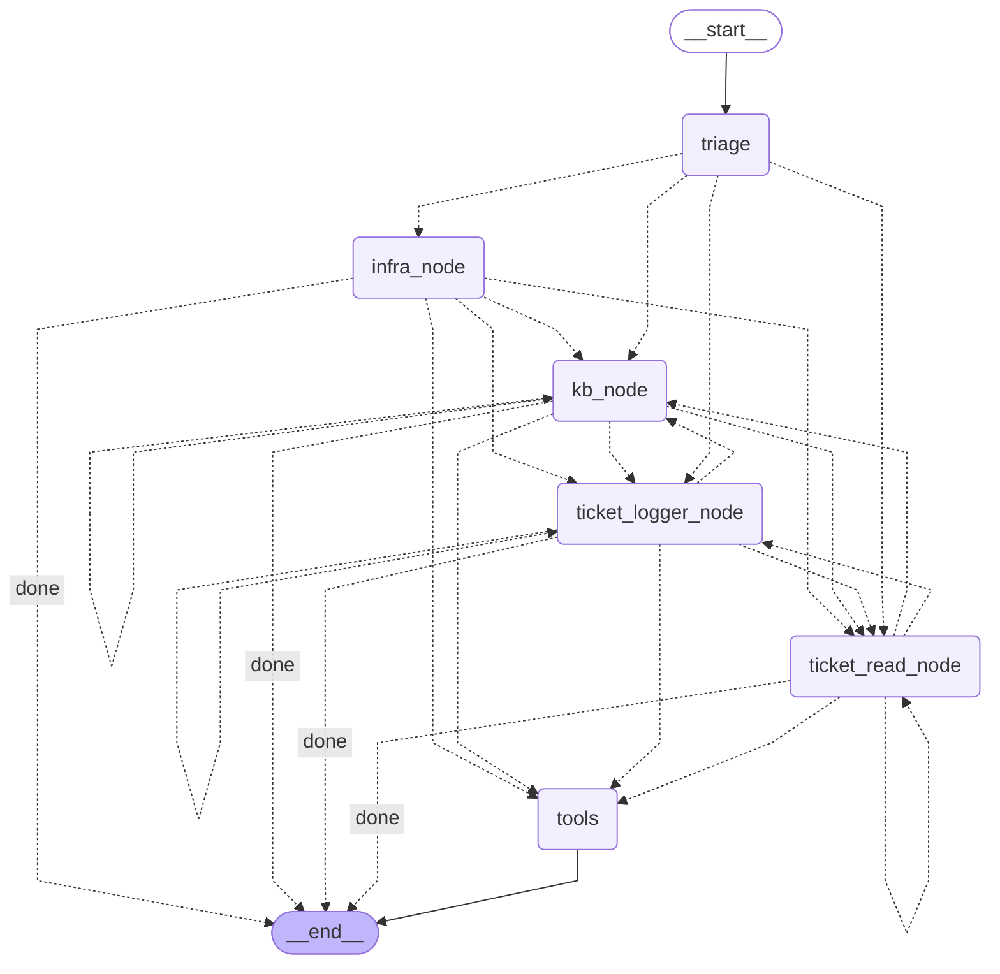

# OpsPilot Agent Graph Architecture

This document contains the visual workflow and state transitions of the OpsPilot multi-agent system.
It is auto-generated on-demand for documentation and architectural review.

## State Graph Flowchart

## Architecture Summary
- **START**: Entry point routing directly to the `triage` node.
- **Triage Node (`triage`)**: Intent classifier determining routing to specialized manager nodes.
- **Specialized Worker Nodes**:
  - `kb_node`: Knowledge Base searches.
  - `infra_node`: System health and infrastructure diagnostics.
  - `ticket_read_node`: Ticket lookup and history queries.
  - `ticket_logger_node`: Ticket creation and updates.
- **ReAct Tool Loop (`tools`)**: Shared `ToolNode` executor; routes back to the calling node upon completion.
- **END**: Concludes interaction once a terminal response is synthesized.
