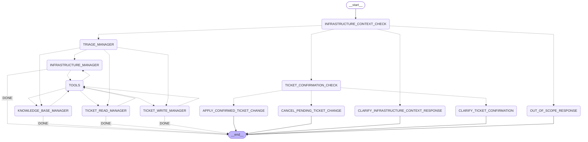

# OpsPilot Agent Graph Architecture

This document contains the visual workflow and state transitions of the OpsPilot multi-agent system.
It is auto-generated on-demand for documentation and architectural review.

## State Graph Flowchart

```mermaid
---
config:
  flowchart:
    curve: linear
---
graph TD;
	__start__([<p>__start__</p>]):::first
	TRIAGE_MANAGER(TRIAGE_MANAGER)
	KNOWLEDGE_BASE_MANAGER(KNOWLEDGE_BASE_MANAGER)
	INFRASTRUCTURE_MANAGER(INFRASTRUCTURE_MANAGER)
	TICKET_READ_MANAGER(TICKET_READ_MANAGER)
	TICKET_WRITE_MANAGER(TICKET_WRITE_MANAGER)
	TOOLS(TOOLS)
	INFRASTRUCTURE_CONTEXT_CHECK(INFRASTRUCTURE_CONTEXT_CHECK)
	OUT_OF_SCOPE_RESPONSE(OUT_OF_SCOPE_RESPONSE)
	CLARIFY_INFRASTRUCTURE_CONTEXT_RESPONSE(CLARIFY_INFRASTRUCTURE_CONTEXT_RESPONSE)
	TICKET_CONFIRMATION_CHECK(TICKET_CONFIRMATION_CHECK)
	CANCEL_PENDING_TICKET_CHANGE(CANCEL_PENDING_TICKET_CHANGE)
	CLARIFY_TICKET_CONFIRMATION(CLARIFY_TICKET_CONFIRMATION)
	APPLY_CONFIRMED_TICKET_CHANGE(APPLY_CONFIRMED_TICKET_CHANGE)
	__end__([<p>__end__</p>]):::last
	INFRASTRUCTURE_CONTEXT_CHECK -.-> CLARIFY_INFRASTRUCTURE_CONTEXT_RESPONSE;
	INFRASTRUCTURE_CONTEXT_CHECK -.-> OUT_OF_SCOPE_RESPONSE;
	INFRASTRUCTURE_CONTEXT_CHECK -.-> TICKET_CONFIRMATION_CHECK;
	INFRASTRUCTURE_CONTEXT_CHECK -.-> TRIAGE_MANAGER;
	INFRASTRUCTURE_MANAGER -.-> TOOLS;
	INFRASTRUCTURE_MANAGER -. &nbsp;DONE&nbsp; .-> __end__;
	KNOWLEDGE_BASE_MANAGER -.-> TOOLS;
	KNOWLEDGE_BASE_MANAGER -. &nbsp;DONE&nbsp; .-> __end__;
	TICKET_CONFIRMATION_CHECK -.-> APPLY_CONFIRMED_TICKET_CHANGE;
	TICKET_CONFIRMATION_CHECK -.-> CANCEL_PENDING_TICKET_CHANGE;
	TICKET_CONFIRMATION_CHECK -.-> CLARIFY_TICKET_CONFIRMATION;
	TICKET_READ_MANAGER -.-> TOOLS;
	TICKET_READ_MANAGER -. &nbsp;DONE&nbsp; .-> __end__;
	TICKET_WRITE_MANAGER -.-> TOOLS;
	TICKET_WRITE_MANAGER -. &nbsp;DONE&nbsp; .-> __end__;
	TOOLS -.-> INFRASTRUCTURE_MANAGER;
	TOOLS -.-> KNOWLEDGE_BASE_MANAGER;
	TOOLS -.-> TICKET_READ_MANAGER;
	TOOLS -.-> TICKET_WRITE_MANAGER;
	TRIAGE_MANAGER -.-> INFRASTRUCTURE_MANAGER;
	TRIAGE_MANAGER -.-> KNOWLEDGE_BASE_MANAGER;
	TRIAGE_MANAGER -.-> TICKET_READ_MANAGER;
	TRIAGE_MANAGER -.-> TICKET_WRITE_MANAGER;
	__start__ --> INFRASTRUCTURE_CONTEXT_CHECK;
	APPLY_CONFIRMED_TICKET_CHANGE --> __end__;
	CANCEL_PENDING_TICKET_CHANGE --> __end__;
	CLARIFY_INFRASTRUCTURE_CONTEXT_RESPONSE --> __end__;
	CLARIFY_TICKET_CONFIRMATION --> __end__;
	OUT_OF_SCOPE_RESPONSE --> __end__;
	classDef default fill:#f2f0ff,line-height:1.2
	classDef first fill-opacity:0
	classDef last fill:#bfb6fc

```

## Architecture Summary

- **START → `INFRASTRUCTURE_CONTEXT_CHECK`**: Entry point. Every user message is validated against the Patliputra-Corp systems catalog before LLM processing.
- **Bounded-Context Gate (`INFRASTRUCTURE_CONTEXT_CHECK`)**: Deterministic keyword search (with LLM keyword-refinement fallback for ambiguous matches). Routes to one of four outcomes:
  - `TRIAGE_MANAGER` — system found, proceed to intent classification.
  - `OUT_OF_SCOPE_RESPONSE` — no catalog match, end turn with a polite rejection.
  - `CLARIFY_INFRASTRUCTURE_CONTEXT_RESPONSE` — 2–3 ambiguous matches, ask user to pick one.
  - `TICKET_CONFIRMATION_CHECK` — a ticket draft is pending user confirmation.
- **Triage Manager (`TRIAGE_MANAGER`)**: Structured-output LLM classifier that routes to one of four specialist managers.
- **Specialist Managers**:
  - `INFRASTRUCTURE_MANAGER` — system/status lookups.
  - `KNOWLEDGE_BASE_MANAGER` — KB article search.
  - `TICKET_READ_MANAGER` — read-only ticket queries.
  - `TICKET_WRITE_MANAGER` — gathers ticket draft details; never calls mutation tools directly.
- **ReAct Tool Loop (`TOOLS`)**: Shared `ToolNode` executor; routes back to the calling manager via `current_branch`.
- **Ticket Confirmation Flow (`TICKET_CONFIRMATION_CHECK`)**: Regex-based yes/no parsing. Routes to:
  - `APPLY_CONFIRMED_TICKET_CHANGE` — executes the persisted draft.
  - `CANCEL_PENDING_TICKET_CHANGE` — clears draft, no DB mutation.
  - `CLARIFY_TICKET_CONFIRMATION` — ambiguous reply, asks again.
- **END**: Concludes the turn once a terminal response is produced.
