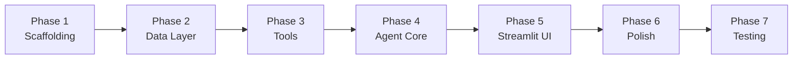

# OpsPilot — Capstone Build Guide

> **Goal**: Build an Agentic AI IT Support Assistant using LangGraph + Streamlit that demonstrates mastery of tool calling, state management, conditional routing, and modular Python architecture.

---

## 1. Project Structure (Modular Architecture)

This is the target structure. You'll build it incrementally, phase by phase.

```
opsPilot/
├── .env                          # API keys (OPENAI_API_KEY, etc.)
├── .env.example                  # Template for collaborators (no secrets)
├── .gitignore
├── README.md
├── requirements.txt              # Pinned dependencies
│
├── app.py                        # Streamlit entry point
│
├── src/
│   └── ops_pilot/
│       ├── __init__.py
│       │
│       ├── agent/                # LangGraph agent definition
│       │   ├── __init__.py
│       │   ├── graph.py          # Graph builder — nodes, edges, compile
│       │   ├── state.py          # TypedDict state schema
│       │   └── router.py         # Conditional routing logic
│       │
│       ├── tools/                # Tool functions (one file per tool)
│       │   ├── __init__.py
│       │   ├── employee_lookup.py
│       │   ├── ticket_manager.py
│       │   ├── knowledge_base.py
│       │   └── system_status.py
│       │
│       ├── prompts/              # System prompts & templates
│       │   ├── __init__.py
│       │   ├── system_prompt.md  # Prompt template (readable, standalone)
│       │   └── loader.py         # Reads .md prompt, optionally injects variables
│       │
│       ├── data/                 # Local JSON/CSV/SQLite data files
│       │   ├── employees.json
│       │   ├── tickets.json
│       │   ├── knowledge_base.json
│       │   └── systems.json
│       │
│       └── config/               # App configuration
│           ├── __init__.py
│           ├── config.yaml       # Static config (model name, data paths, app settings)
│           └── settings.py       # Thin loader — reads config.yaml + .env
│
├── tests/                        # Unit & integration tests
│   ├── __init__.py
│   ├── conftest.py               # pytest fixtures (test setup, shared test data)
│   ├── test_tools.py
│   ├── test_router.py
│   └── test_graph.py
│
└── docs/                         # Documentation & architecture notes
    └── architecture.md
```

> [!IMPORTANT]
> ### Why this structure matters (Java → Python mapping)
> As a Java developer, think of it this way:
> - `src/ops_pilot/` → your main package (like `com.company.opspilot`)
> - `agent/` → the orchestration layer (like a Spring controller + service layer)
> - `tools/` → individual service classes (each with a single responsibility)
> - `prompts/` → externalized message templates (`.md` files, like Spring message bundles)
> - `data/` → embedded resources / seed data
> - `config/` → Spring Boot's `application.yml` equivalent (`config.yaml` + thin Python loader)

---

## 2. Tech Stack & Dependencies

| Dependency | Purpose | Why this one |
|---|---|---|
| `langchain-core` | Base abstractions (tools, messages, prompts) | Industry standard for LLM apps |
| `langchain-openai` | OpenAI LLM integration | Primary provider for tool calling |
| `langchain-google-genai` | Google Gemini LLM integration | Secondary provider; good to show flexibility |
| `langgraph` | Agent graph — state, routing, multi-step | Core requirement; gives you explicit control |
| `streamlit` | Frontend UI | Fast, Python-native, no JS needed |
| `python-dotenv` | Load `.env` secrets | Industry standard for config |
| `pyyaml` | Parse `config.yaml` | Lightweight YAML loader |
| `pydantic` | Data validation & schemas | You'll love this — think Java records + Bean Validation |
| `pytest` | Testing | Python's JUnit equivalent |

> [!NOTE]
> ### LLM Provider Setup
> **Primary:** OpenAI (`gpt-4o-mini` — cheap, excellent tool calling)  
> **Secondary:** Google Gemini (`gemini-2.0-flash` — fast, capable)  
> Both API keys go in `.env`. The active provider is configured in `config.yaml` so you can switch without code changes.

---

## 3. Build Phases

### Phase 1: Project Scaffolding *(~30 min)*

**What you'll do:**
- Create the full folder hierarchy and `__init__.py` files
- Set up virtual environment (`python -m venv venv`) and `requirements.txt`
- Install core dependencies (`pip install -r requirements.txt`)
- Set up `.gitignore`, `.env.example`, and `.env`
- Create `config.yaml` (static settings) + `settings.py` (thin loader that reads YAML + `.env`)
- Verify everything runs with a simple "hello world" Streamlit app
- Initialize Git repo and make the first commit

**Skills demonstrated:** Python project setup, modular architecture, configuration management

---

### Phase 2: Data Layer *(~45 min)*

**What you'll do:**
- Design and create seed data files (JSON) for:
  - `employees.json` — ~10 fictional employees with ID, name, department, email, device info
  - `tickets.json` — ~15 IT tickets with ID, status, priority, description, assigned_to, created_date
  - `knowledge_base.json` — ~10 FAQ-style articles (password reset, VPN setup, printer issues, etc.)
  - `systems.json` — ~5 internal systems with name, status (operational/degraded/down), last_checked
- Use **Pydantic models** to define schemas for each data type
- Write loader functions that read JSON → Pydantic models

**Skills demonstrated:** Local data/database integration, Pydantic, Python data modeling

> [!TIP]
> ### Design Tip
> Keep IDs simple (EMP001, TKT001, KB001, SYS001). This makes the demo easy to follow and debug.

---

### Phase 3: Tool Functions *(~1-2 hours)*

**What you'll do — build 5 tools, one file each:**

| Tool | File | What it does |
|---|---|---|
| `lookup_employee` | `employee_lookup.py` | Search by name or ID → return employee details |
| `search_tickets` | `ticket_manager.py` | Search tickets by employee, status, or keyword |
| `create_ticket` | `ticket_manager.py` | Create a new IT ticket (writes to JSON) |
| `search_knowledge_base` | `knowledge_base.py` | Search KB articles by keyword → return matching articles |
| `check_system_status` | `system_status.py` | Return current status of all or specific systems |

Each tool will be decorated with `@tool` from LangChain, which makes it automatically callable by the LLM.

**Example pattern** (you'll write the actual code yourself):
```python
from langchain_core.tools import tool

@tool
def lookup_employee(query: str) -> str:
    """Look up an employee by name or employee ID.
    Use this when the user asks about an employee's details,
    department, email, or device information."""
    # Your implementation here
    ...
```

**Skills demonstrated:** Tool calling, function calling, modular architecture, error handling

> [!IMPORTANT]
> ### Docstrings are Prompts
> The `@tool` docstring is literally what the LLM reads to decide whether to call this tool. This is **prompt engineering** applied to tool definitions. Make them clear and specific.

---

### Phase 4: Agent Core — State + Graph + Router *(~2-3 hours)*

This is the heart of the project. You'll build the LangGraph agent in three files:

#### 4a. `state.py` — State Schema
Define the `AgentState` as a `TypedDict` that flows through every node in your graph. Think of this like a request context object in Java.

Key fields to include:
- `messages` — conversation history (LangChain message objects)
- Any other metadata you want to track across steps

#### 4b. `router.py` — Conditional Routing Logic
A function that inspects the LLM's response and decides:
- Did the LLM call a tool? → route to **tool execution node**
- Did the LLM produce a final answer? → route to **END**

This is your **conditional edge** in the graph.

#### 4c. `graph.py` — Graph Builder
Wire everything together:
```
[START] → [agent_node] → (router decision)
                              ├── tool_call → [tool_node] → [agent_node]  (loop back)
                              └── final_answer → [END]
```

**This is the core agentic loop:**
1. LLM receives user message + available tools
2. LLM decides: call a tool OR respond directly
3. If tool called → execute tool → feed result back to LLM → repeat
4. If final answer → return to user

**Skills demonstrated:** LangGraph, agentic AI, state management, conditional routing, multi-step workflow

> [!TIP]
> ### Mental Model (Java Analogy)
> Think of the LangGraph graph as a **state machine** (like Spring State Machine):
> - **Nodes** = handler methods
> - **Edges** = transitions
> - **State** = the context object passed through the pipeline
> - **Conditional edges** = transition guards

---

### Phase 5: Streamlit UI *(~1-2 hours)*

**What you'll build:**
- Chat interface with message history
- Sidebar with app info / branding
- Session state management (Streamlit's `st.session_state`)
- Connect UI to LangGraph agent
- Display tool calls transparently (show the user which tools were invoked)

**Key Streamlit patterns you'll use:**
- `st.chat_message()` / `st.chat_input()` — the chat UI
- `st.session_state` — persist conversation across reruns
- `st.status()` or `st.expander()` — show tool execution details
- `st.sidebar` — app info, reset button

**Skills demonstrated:** Streamlit, session management, UX

---

### Phase 6: Error Handling & Polish *(~1 hour)*

**What you'll add:**
- Graceful error handling in every tool (try/except → user-friendly messages)
- Input validation via Pydantic
- Fallback responses when tools fail or data not found
- Loading states in the UI
- A "Reset Conversation" button

**Skills demonstrated:** Error handling, robustness, production-readiness

---

### Phase 7: Testing *(~1 hour)*

**What you'll test:**
- `test_tools.py` — Each tool returns expected results for known inputs
- `test_router.py` — Router correctly identifies tool calls vs. final answers
- `test_graph.py` — End-to-end: send a message → get a response (integration test)

**Skills demonstrated:** pytest, test-driven quality

---

## 4. Build Order Summary



| Phase | Estimated Time | Skills Covered |
|---|---|---|
| 1. Scaffolding | 30 min | Python, modular architecture, config |
| 2. Data Layer | 45 min | Data integration, Pydantic |
| 3. Tools | 1–2 hrs | Tool calling, function calling, error handling |
| 4. Agent Core | 2–3 hrs | LangGraph, state, routing, agentic AI, prompt engineering |
| 5. Streamlit UI | 1–2 hrs | Streamlit |
| 6. Polish | 1 hr | Error handling, UX |
| 7. Testing | 1 hr | pytest |
| **Total** | **~7–10 hrs** | **All 12 skills** |

---

## 5. Skills Checklist

Every required skill mapped to where it appears:

| Skill | Where Demonstrated |
|---|---|
| Python | Everywhere |
| LangGraph | Phase 4 — `graph.py`, `state.py`, `router.py` |
| Agentic AI | Phase 4 — the autonomous tool-calling loop |
| Tool Calling | Phase 3 — `@tool` decorated functions |
| Function Calling | Phase 3–4 — LLM decides which function to invoke |
| State Management | Phase 4 — `AgentState` TypedDict, Streamlit `session_state` |
| Conditional Routing | Phase 4 — `router.py` conditional edges |
| Local Data/DB Integration | Phase 2 — JSON data + Pydantic loaders |
| Prompt Engineering | Phase 3–4 — tool docstrings + system prompt |
| Streamlit | Phase 5 — full chat UI |
| Error Handling | Phase 6 — try/except, validation, fallbacks |
| Modular Architecture | Phase 1 — project structure, separation of concerns |

---

## Decisions Locked In ✅

| Decision | Choice | Rationale |
|---|---|---|
| Package Manager | `pip` + `venv` + `requirements.txt` | Familiar from course; no extra learning curve |
| Config Format | `config.yaml` + thin `settings.py` loader | Familiar from Java (`application.yml`); clean separation |
| Prompt Format | `system_prompt.md` + `loader.py` | Readable standalone; evaluators can review without reading Python |
| Test Config | `conftest.py` (pytest fixtures) | Python's equivalent of `@BeforeEach` / test resource injection |
| Git | Yes, from Phase 1 | Essential for a capstone project |
| LLM Providers | OpenAI (primary) + Google Gemini (secondary) | Dual-provider shows flexibility; switchable via `config.yaml` |
| Python Version | 3.14.7 | Latest stable; all dependencies compatible |

> [!TIP]
> All decisions are finalized. No open questions remain.

---

## What's Next

**Phase 1: Project Scaffolding** — you write every line, I guide you through each step. Let's go! 🚀
